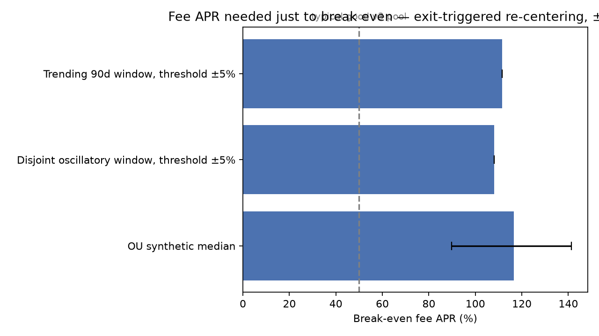

# CLRE Concentrated-Liquidity Rebalancing Study (v3)

**TL;DR — should you auto-rebalance a tight Uniswap v3 position? Mostly no.**

- At ±5% width, exit-triggered re-centering needs a **111.6% fee APR just to break even** on a trending 90-day window (108.0% on a disjoint oscillatory one). Very few pools ever pay that.
- Explicit costs (gas + swap fees) are only **3–4% of the damage**. The rest is the policy itself: re-centering at its own trigger scale is structurally **short realized variance** — a discrete LVR maximiser (Milionis et al. 2022), invariant to path structure. (v2's "short mean-reversion" label was falsified by the OU control and retracted; the log keeps the retraction.)
- The thing that IS regime-dependent is the static tight range (33.5% trending → 1.2% oscillatory), **not** the re-centering decision.



**Question:** how should a Uniswap-v3-style LP position be rebalanced, and what does each policy actually cost?

**Full result:** threshold ±5% loses on **200 of 200** pure mean-reverting (OU) synthetic paths, median break-even 116.5% [5–95pct: 89.7–141.3].

**Read first:** `final/CLRE_v3.1_Rebalancing_Study_Marco_Amendola.pdf` (4 pages).

## Reproduce
```
python3 tests.py              # 9/9 sanity suite — required before any run
python3 reproduce_gate.py     # replays published numbers from archived inputs
python3 adversarial_check3.py # every PDF number verified against runs/*.json
```
Archived hourly inputs for every window ship in `runs/` — the gate runs
offline. Synthetic study: seed 42, parameters logged before the run.

## Structure
- `clre.py` — engine: exact v3 position math, policies, costs, evaluation
- `tests.py` — nine-test validation suite
- `reproduce_gate.py`, `adversarial_check3.py` — gates
- run2.py, scan_windows.py, build_pdf3.py — runs and artifact build (superseded scripts in archive/)
- make_figure.py — README figure
- `runs/` — archived inputs + full outputs (run002/003/004/004b, gate, scan, fee anchor)
- `research_log.md`  pre-registered predictions (including the failed ones),
  two v2 errata, belief updates. The credibility artifact.
- `adversarial.md`  both adversarial passes, findings triaged, repairs
- `brief.md`  origin and acceptance criteria

## Method discipline
Predictions pre-registered before every run (Run 002: 2/4 failed — the
failures produced the main finding; Run 003: 5/5; Run 004: 4/4). Reproduction
gate before any new run. Fee income inverted (break-even APR), not assumed;
pool-level anchor measured (DeFiLlama series; Dune query 7923963 published).
Known limitations and the production path per gap are stated inside the PDF.

## What this means in practice

The break-even numbers above are a bar. A pool clears it only if its sustained
fee APR exceeds the break-even for your width and regime — and pools paying
100%+ sustained are rare and usually paying you for a risk. Before enabling
any auto-rebalancing policy on a position: (1) measure the pool's realised fee
APR over a window at least as long as your expected holding period (anchor
query: [Dune 7923963](https://dune.com/queries/7923963)), (2) compare it to
the break-even for your width from this study, (3) if it doesn't clear, a
static range — re-chosen only on regime change — dominated every re-centering
policy tested here.

Live monitor: [CLRE Break-Even Monitor on Dune](https://dune.com/x1a0x1a0/clre-break-even-monitor) — which top pools currently clear the bar, refreshed weekly.

*Marco Amendola · July 2026 · on-chain research under [Xpertknight](https://dune.com/xpertknight) · not investment advice*
